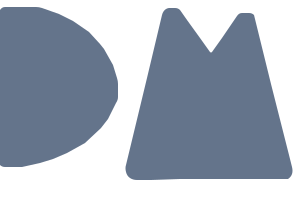

  

  

    

      <strong>Hi, I'm Daniel 👋</strong> 
      Full-stack developer building beautiful and efficient web apps with a love for clean code and intuitive design.
    

    

      <a href="https://danielmv.com" target="_blank">🌐 Portfolio</a>
    

  

A few things I enjoy beyond the code:

### 📊 GitHub Stats

### 💻 Lifetime Coding Metrics

________

  
📁 About This Repository

  This repository contains the code for my personal portfolio, built with **React**, **Next.js**, **TypeScript**, and **Tailwind CSS**. It’s designed to showcase my career path, skills, and selected projects.  
  
  It includes:

  - 🌓 A dark/light theme toggle with smooth transitions  
  - 🔗 Links to my profiles on GitHub, Wakatime, Trakt, Stats.fm, and Goodreads  
  - 🔥 Firebase Firestore integration for data  
  - ▲ Deployed via Vercel  
  - 📱 Responsive design across devices  

  The codebase is cleanly organized and fully tested with **Vitest**.

